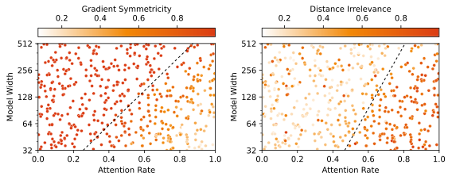

# The Clock and the Pizza: Two Stories in Mechanistic Explanation of Neural Networks

This is the code repository for our paper [The Clock and the Pizza: Two Stories in Mechanistic Explanation of Neural Networks](https://arxiv.org/abs/2306.17844), accepted by NeurIPS 2023 (oral).




## How to Replicate

Some trained models are available in `code/save/`, including `ModelA` and `ModelB` in the paper. Use `code/eval-main.ipynb` (for transformers) and `code/eval-linear.ipynb` (for linear models) to calculate the metrics of the trained models. To train models from scratch, use `code/train-main.py` for transformers and `code/train-linear.py` for linear models.

The collection of all the trained models are not released for size concerns, but two tables of stats collected across all 1-layer runs are available as `result/1l_fixedwidth.csv` and `result/1l_varywidth.csv`. The former is for the fixed-width experiments and the latter is for the varying-width experiments. Note that the two tables also contain runs with slightly different settings: runs with 1 in `diff_vocab` and `eqn_sign` columns correspond to the runs in the appendix. You may also want to filter out non-circular runs (`circularity` column).

## Citation

```
@article{zhong2023clock,
  title={The clock and the pizza: Two stories in mechanistic explanation of neural networks},
  author={Zhong, Ziqian and Liu, Ziming and Tegmark, Max and Andreas, Jacob},
  journal={arXiv preprint arXiv:2306.17844},
  year={2023}
}
```